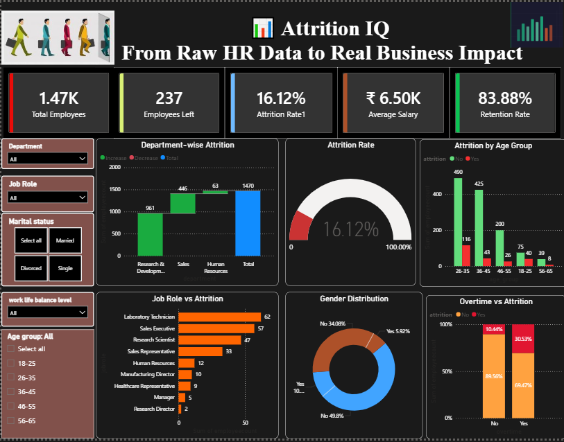

# 🧠 AttritionIQ — HR Attrition Intelligence Dashboard

> End-to-end HR Attrition Analysis using SQL, Python, Excel & Power BI | 16% attrition insights across departments, age groups & job roles.

---

## 📌 Project Overview

**AttritionIQ** is a full-stack data analytics project that investigates employee attrition patterns using the [IBM HR Analytics Employee Attrition & Performance dataset](https://www.kaggle.com/datasets/pavansubhasht/ibm-hr-analytics-attrition-dataset) from Kaggle.

The project answers critical HR questions like:
- Which departments and roles have the highest attrition rates?
- How do salary, age, and overtime influence an employee's decision to leave?
- What profiles are most at risk of attrition?

The pipeline spans **SQL-based exploration → Python EDA → Excel summaries → Power BI dashboard**, mirroring real-world analyst workflows.

---

## 🗂️ Repository Structure

```
AttritionIQ/
│
├── Data/                  # Raw and cleaned datasets
├── SQL/                   # SQL queries for exploration & aggregation
├── Notebook/              # Python EDA notebook (Pandas, Matplotlib, Seaborn)
├── Dashboard/             # Power BI / Excel dashboard files
├── assets/                # Screenshots, charts, images
└── README.md
```

---

## 🔍 Key Findings

| Metric | Value |
|---|---|
| Overall Attrition Rate | **16.1%** |
| Highest-Risk Department | **Sales** |
| Highest-Risk Role | **Sales Representative** |
| Attrition by Overtime | Employees doing overtime are **~3× more likely** to leave |
| Salary vs Attrition | Employees earning below median have significantly higher attrition |
| Peak Attrition Age Group | **26–35 years** |

---

## 🛠️ Tools & Technologies

| Layer | Tools Used |
|---|---|
| Data Cleaning | Python (Pandas), Excel |
| Exploratory Analysis | Python (Matplotlib, Seaborn) |
| SQL Analysis | MySQL / SQLite |
| Visualization | Power BI / Tableau |
| Dataset Source | IBM HR Analytics (Kaggle) |

---

## 📊 Analysis Breakdown

### 1. SQL Analysis (`/SQL`)
- Department-wise attrition counts and percentages
- Salary band segmentation by attrition status
- Overtime vs attrition cross-tabulation
- Job role ranking by attrition rate
- Tenure and promotion gap analysis

### 2. Python EDA (`/Notebook`)
- Distribution plots for age, income, and years at company
- Correlation heatmap of key HR features
- Attrition rate by job role, department, education field
- Boxplots: monthly income vs attrition
- Feature importance preview using value counts and groupby aggregations

### 3. Power BI Dashboard (`/Dashboard`)
- KPI cards: total employees, attrition count, attrition rate
- Bar charts: attrition by department and job role
- Slicers: filter by gender, department, marital status
- Trend view: attrition by age group and years at company

---

## 📸 Dashboard Preview




---

## 🚀 How to Run

### Python Notebook
```bash
# Clone the repo
git clone https://github.com/Divyakonnur25/AttritionIQ.git
cd AttritionIQ

# Install dependencies
pip install pandas matplotlib seaborn jupyter

# Launch notebook
jupyter notebook Notebook/attrition_eda.ipynb
```

### SQL Queries
Open the `.sql` files in the `/SQL` folder using MySQL Workbench, DBeaver, or any SQL client. Import the dataset from `/Data` before running the queries.

---

## 📁 Dataset

- **Source:** [IBM HR Analytics Employee Attrition & Performance — Kaggle](https://www.kaggle.com/datasets/pavansubhasht/ibm-hr-analytics-attrition-dataset)
- **Records:** 1,470 employees
- **Features:** 35 columns including Age, Department, JobRole, MonthlyIncome, OverTime, Attrition, and more

---

## 💡 Business Impact

This analysis can help HR teams:
- Identify **high-risk employee segments** before they leave
- Build **retention strategies** targeting overtime-heavy, low-salary roles
- Design **department-specific interventions** for Sales and R&D
- Inform **compensation benchmarking** with data-backed salary analysis

---

## 👩‍💻 Author

**Divya Konnur**
Data Analyst | SQL · Python · Power BI · Excel

## Connect With Me

[](https://github.com/Divyakonnur25)

[](https://www.linkedin.com/in/divya-konnur-4982a3345)

---

## 📄 License

This project is open-source and available under the [MIT License](LICENSE).# AttritionIQ
End-to-end HR Attrition Analysis using SQL, Python, Excel &amp; Power BI |  16% attrition insights across departments, age groups &amp; job roles.
